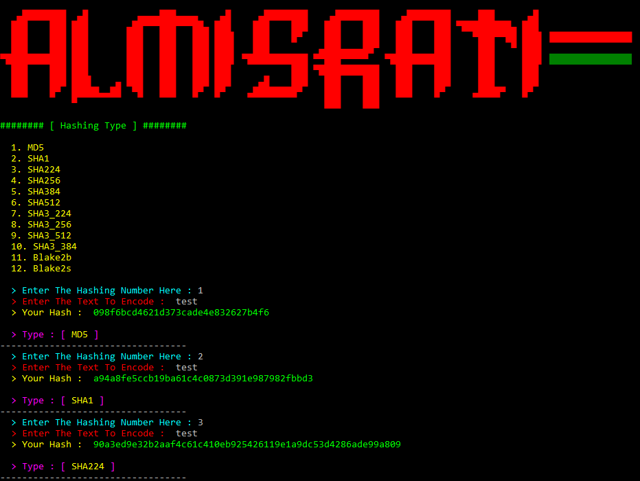

# Script : Hashlol
**Encryption Type:**

```
> MD5
> SHA1
> SHA224
> SHA256
> SHA384
> SHA512
> SHA3_224
> SHA3_256
> SHA3_512
> SHA3_384
> Blake2b
> Blake2s
```
______________________________________
**_It works on Python3 only, I used 3.7.4_**
______________________________________
Facebook : [r00tly](https://www.facebook.com/r00tly)

**_ScreenShot From Script :_**



